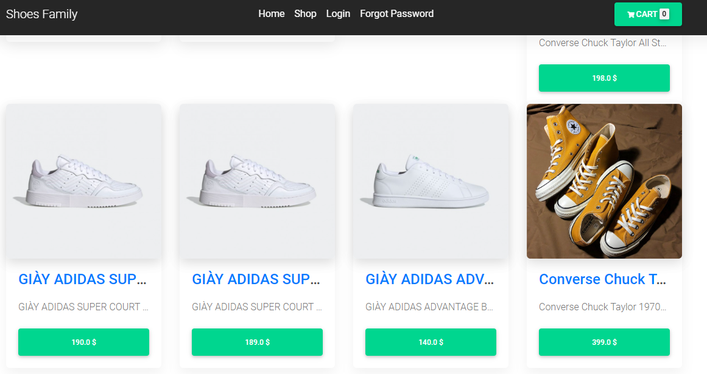
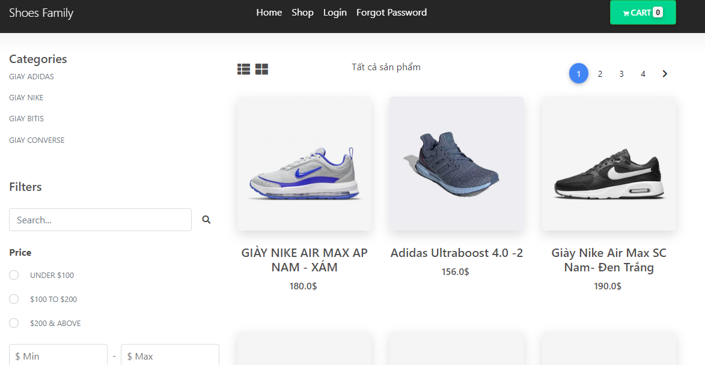
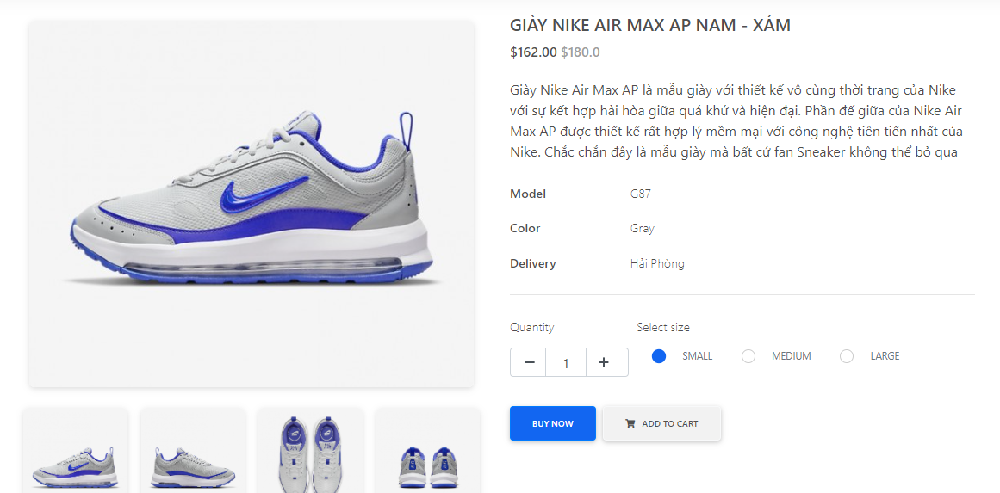
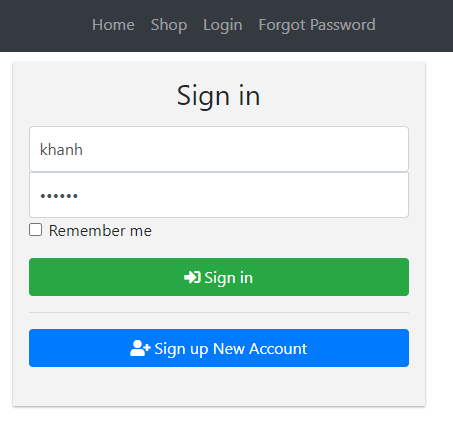
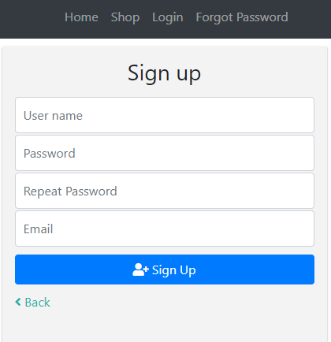
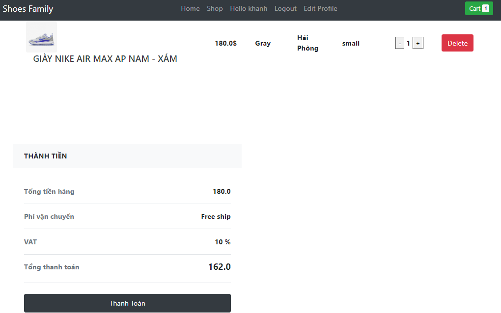
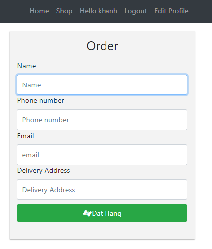
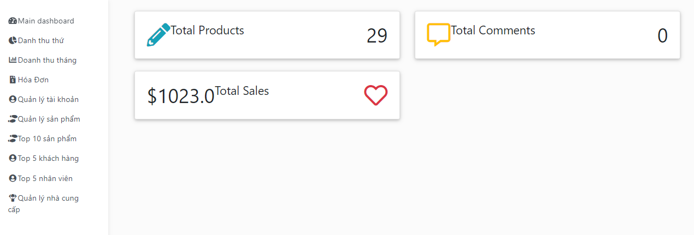
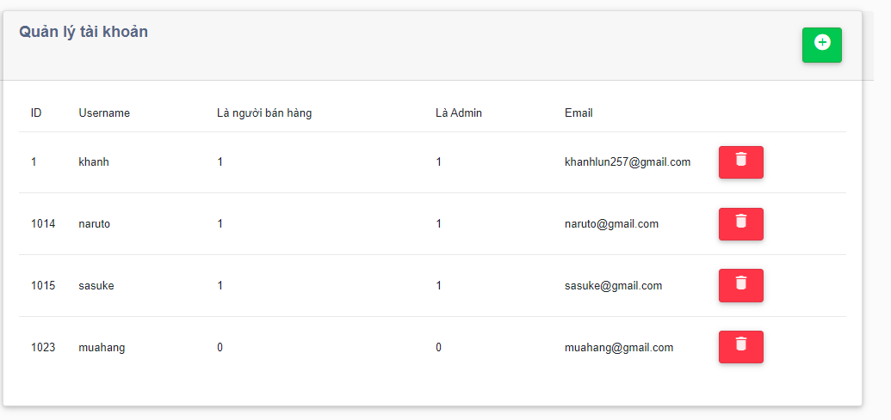
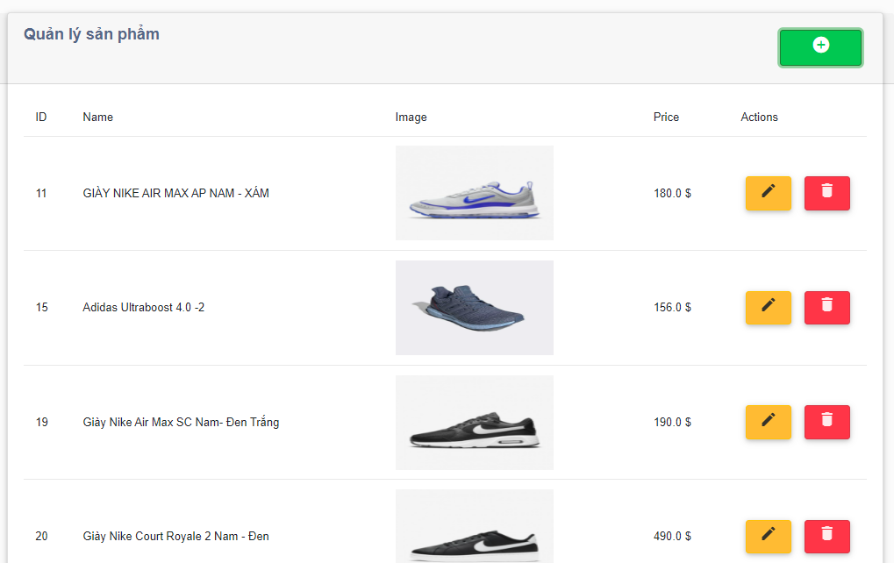

# Mô tả website bán giầy - Java web
## Sử dụng SQL server xây dựng database

## Home page

## Shop page

# Chi tiết sản phẩm

### Khách hàng thực hiện đăng nhập mới được phép tạo giỏ hàng
## Trang đăng ký đăng nhập

## Trang giỏ hàng

## Trang thanh toán
### Khách hàng điền đủ thông tin để thực hiện tạo đơn hàng

## Trang Admin
### Tài khoản được cấp quyền admin mới truy cập được vào trang Admin

### Quản lý tài khoản

### Quản lý sản phẩm
